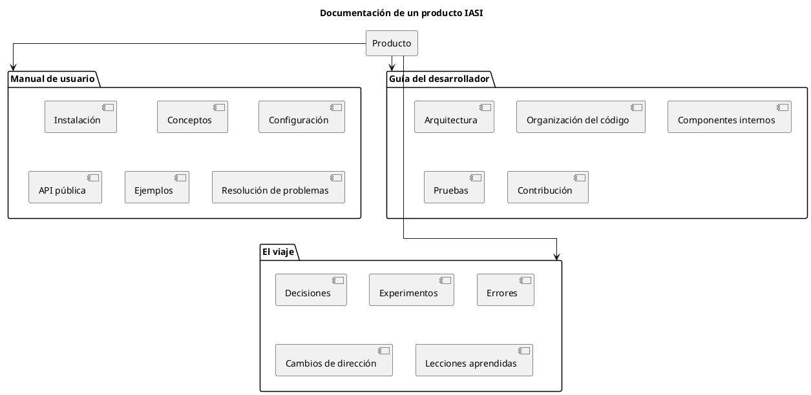

# ADR-005 - Estructura de la documentación de un producto

- **Estado:** Aceptado
- **Fecha:** 2026-08-04

## Contexto

Los proyectos del ecosistema IASI no solo generan software, sino también conocimiento.

Ese conocimiento tiene diferentes destinatarios y objetivos. La documentación debe organizarse de forma que cada lector encuentre la información que necesita sin duplicidades ni estructuras artificiales.

Durante el diseño de la documentación de `iasi.quarto` se evaluaron diferentes modelos documentales, concluyendo que la organización debe responder al perfil del lector y no a categorías documentales predefinidas.

## Decisión

La documentación de un producto IASI se organizará inicialmente en tres libros independientes.

### Manual de usuario

Orientado a quienes desean utilizar el producto.

Incluye toda la información necesaria para instalarlo, configurarlo y utilizarlo correctamente, incluida la documentación de la API pública.

### Guía del desarrollador

Orientada a quienes desean comprender, mantener o ampliar el producto.

Describe la arquitectura, la organización interna, las convenciones de desarrollo, la estrategia de pruebas y el proceso de contribución.

### El viaje

Documenta la evolución del producto.

Recoge las decisiones de ingeniería, los experimentos realizados, las alternativas descartadas y las razones que justifican la arquitectura actual.

## Consecuencias

- Cada libro responde a un perfil de lector claramente identificado.
- La API pública forma parte del Manual de usuario.
- Se evita la duplicación de contenidos.
- La documentación evoluciona de forma coherente con el producto.
- La estructura podrá ampliarse cuando aparezcan nuevas necesidades reales.

## Justificación

IASI organiza la documentación atendiendo a las necesidades de sus lectores y no a modelos documentales predefinidos.

Cada libro existe porque responde a una finalidad concreta:

- aprender a utilizar el producto;
- comprender y evolucionar su implementación;
- conservar el conocimiento generado durante su desarrollo.

Esta organización podrá evolucionar si la experiencia demuestra la necesidad de nuevos artefactos documentales.