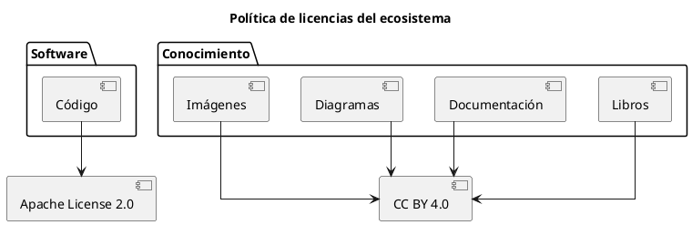

# ADR-006 - Política de licencias

- **Estado:** Aceptado
- **Fecha:** 2026-08-04

## Contexto

El ecosistema IASI está formado por distintos tipos de artefactos:

- software;
- documentación;
- libros;
- imágenes y recursos gráficos;
- plantillas y estándares.

No todos estos artefactos tienen la misma naturaleza jurídica ni los mismos requisitos de reutilización.

Es necesario establecer una política común de licenciamiento para todo el ecosistema.

## Decisión

IASI utilizará licencias diferentes según la naturaleza del artefacto.

### Software

Todo el software desarrollado dentro del ecosistema utilizará, por defecto:

**Apache License 2.0**

### Documentación

La documentación, los libros y el resto del conocimiento publicado utilizarán, por defecto:

**Creative Commons Attribution 4.0 International (CC BY 4.0)**

## Consecuencias

- El software dispone de una licencia específica para código.
- La documentación utiliza una licencia específica para obras intelectuales.
- Se facilita la reutilización del conocimiento.
- Se mantiene una política homogénea en todo el ecosistema.

## Justificación

Software y documentación tienen naturalezas diferentes.

IASI adopta la licencia que mejor se adapta a cada tipo de artefacto, evitando utilizar una única licencia para elementos con objetivos distintos.