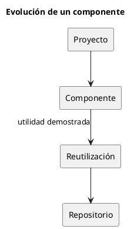

# ADR-007 - Creación de nuevos repositorios

- **Estado:** Aceptado
- **Fecha:** 2026-08-04

## Contexto

El ecosistema IASI evoluciona de forma incremental.

Durante el desarrollo de un proyecto aparecen componentes, documentación, herramientas o recursos que inicialmente forman parte del propio proyecto.

Con el tiempo, algunos de estos elementos demuestran tener utilidad más allá del contexto en el que nacieron.

Es necesario establecer un criterio para decidir cuándo un elemento debe permanecer integrado en el proyecto y cuándo debe convertirse en un repositorio independiente.

## Decisión

Un nuevo repositorio solo se creará cuando exista una responsabilidad claramente diferenciada y un potencial de reutilización por parte de otros proyectos del ecosistema.

La creación de un nuevo repositorio deberá responder, al menos, afirmativamente a las siguientes preguntas:

- ¿Tiene una responsabilidad claramente definida?
- ¿Puede evolucionar de forma independiente?
- ¿Resulta útil para otros proyectos?
- ¿Reduce duplicidades dentro del ecosistema?

Si la respuesta es negativa, el componente permanecerá integrado en el proyecto original.

## Consecuencias

- Se evita la proliferación de repositorios innecesarios.
- Los nuevos proyectos nacen únicamente cuando existe una necesidad real.
- Cada repositorio mantiene una responsabilidad claramente definida.
- La arquitectura del ecosistema evoluciona de forma natural.

## Justificación

IASI no planifica componentes por anticipado.

Los componentes aparecen cuando la experiencia demuestra que una responsabilidad merece independizarse y convertirse en un elemento reutilizable del ecosistema.