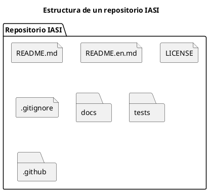

# ADR-008 - Estructura estándar de un repositorio

- **Estado:** Aceptado
- **Fecha:** 2026-08-04

## Contexto

El ecosistema IASI está formado por múltiples repositorios independientes.

Mantener una estructura homogénea facilita el mantenimiento, reduce la curva de aprendizaje y proporciona una experiencia consistente a usuarios y colaboradores.

Es necesario definir una estructura mínima común para todos los repositorios del ecosistema.

## Decisión

Todos los repositorios IASI deberán seguir una estructura común.

La estructura podrá ampliarse según las necesidades del proyecto, pero los elementos comunes deberán mantenerse.

### Elementos comunes

Todos los repositorios incluirán, al menos:

- `README.md`
- `README.en.md`
- `LICENSE`
- `.gitignore`

### Elementos opcionales

Dependiendo de la naturaleza del proyecto podrán incorporarse, entre otros:

- `docs/`
- `tests/`
- `.github/`
- `examples/`
- `data/`

La estructura concreta será definida por el tipo de proyecto correspondiente.

## Consecuencias

- Todos los proyectos presentan una estructura homogénea.
- Los colaboradores encuentran los mismos elementos en cualquier repositorio.
- Las plantillas del ecosistema pueden automatizar la creación de nuevos proyectos.
- Los estándares evolucionan de forma centralizada.

## Justificación

La consistencia entre proyectos reduce el esfuerzo de mantenimiento y facilita la reutilización de componentes y herramientas.

La estructura mínima constituye un estándar del ecosistema y no impide que cada proyecto incorpore los elementos adicionales que necesite.