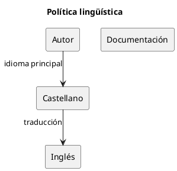

# ADR-009 - Idioma oficial de la documentación

- **Estado:** Aceptado
- **Fecha:** 2026-08-04

## Contexto

IASI nace como un proyecto abierto con vocación internacional.

Sin embargo, la lengua de trabajo de sus autores es el castellano.

La experiencia demuestra que la calidad técnica, la precisión conceptual y la capacidad de expresar matices son mayores cuando la documentación se redacta en la lengua materna.

Al mismo tiempo, el ecosistema desea ser accesible para la comunidad internacional.

Es necesario establecer una política lingüística común.

## Decisión

El idioma principal de la documentación del ecosistema IASI será el castellano.

Siempre que resulte posible, la documentación dispondrá también de una versión en inglés.

Cuando una traducción aún no exista, los documentos incluirán una nota indicando que podrá proporcionarse bajo demanda.

## Principios

- La precisión técnica tiene prioridad sobre la traducción inmediata.
- La documentación se redactará inicialmente en castellano.
- Las traducciones deberán preservar el significado del documento original.
- El inglés facilitará la difusión internacional del ecosistema.

## Consecuencias

- El castellano constituye la fuente de verdad de la documentación.
- La documentación en inglés podrá evolucionar de forma progresiva.
- Los lectores internacionales dispondrán de una vía para acceder al contenido del ecosistema.

## Justificación

IASI considera que la claridad y la precisión son fundamentales en la documentación técnica.

Redactar inicialmente en la lengua materna permite expresar con mayor exactitud los conceptos de ingeniería.

Las traducciones amplían el alcance del proyecto sin comprometer la calidad del contenido original.