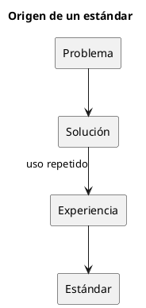

# ADR-010 - Los estándares emergen de la experiencia

- **Estado:** Aceptado
- **Fecha:** 2026-08-04

## Contexto

Tradicionalmente, muchas metodologías comienzan definiendo un conjunto amplio de normas, convenciones y procesos antes de que exista una necesidad real.

Esta aproximación suele generar complejidad innecesaria y estándares que nunca llegan a utilizarse.

IASI adopta una aproximación diferente: los estándares deben surgir como consecuencia de la experiencia adquirida durante el desarrollo de proyectos reales.

## Decisión

Los estándares del ecosistema no se diseñarán de forma anticipada.

Un estándar únicamente se incorporará al ecosistema cuando una solución haya demostrado su utilidad mediante su aplicación repetida en uno o varios proyectos.

Un estándar deberá cumplir, al menos, las siguientes condiciones:

- resolver un problema real;
- haber demostrado su utilidad;
- resultar reutilizable;
- simplificar futuros desarrollos.

## Consecuencias

- Se evita la creación de estándares innecesarios.
- Los estándares reflejan la experiencia acumulada del ecosistema.
- La evolución del ecosistema permanece alineada con las necesidades reales de los proyectos.
- Cada estándar incorpora una justificación basada en la práctica.

## Justificación

IASI considera que un estándar es conocimiento consolidado, no una hipótesis.

Los estándares no representan una intención de diseño, sino el resultado de decisiones que han demostrado aportar valor de forma repetida.

De este modo, el ecosistema evoluciona de forma incremental, fundamentando sus estándares en la experiencia y no en la anticipación.